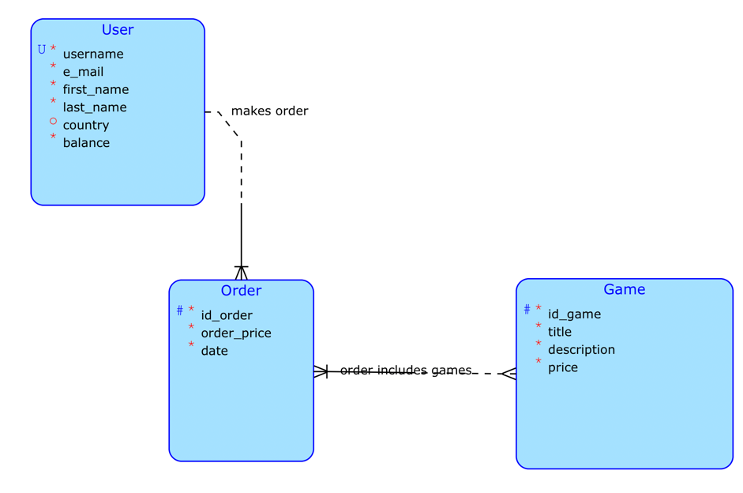
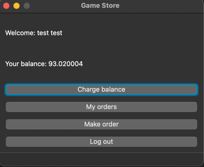

# GAME SHOP

This is an online computer game store where you can buy the digital version of the game.

# Buisness operation :

"Process order" button. If the user has something in the basket and has enough money in his account, then an order is created, otherwise he is notified of a lack of money.

# Complex request

On the user's side, it is possible to change an order that has not yet been processed: delete a game from the order. The money for her will be returned to his account.
# Client

The application has a frontend client GUI-interface written in Python with the help of the PyQt6 and requests libraries.
It can only be run if Python 3.8 and the PyQt6 and requests libraries are installed.

